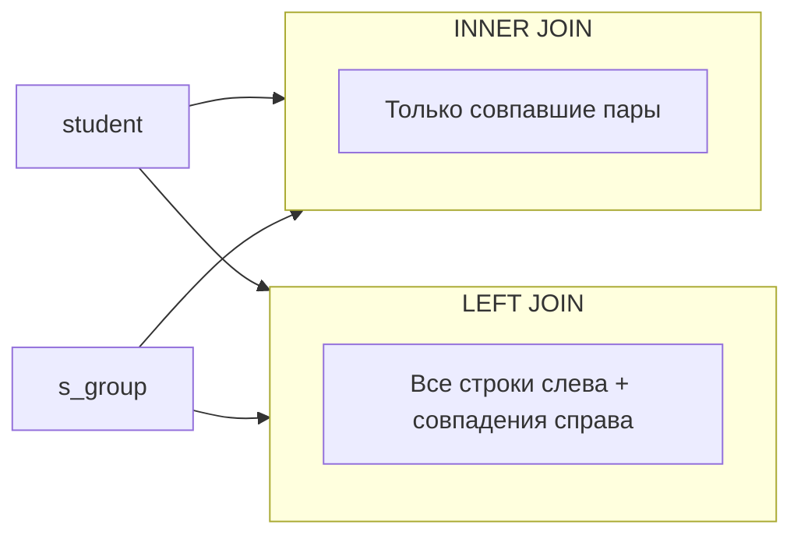

## Соединения таблиц: обзор и синтаксис

**Часть:** SQL: язык манипулирования и определения данных · **Модуль:** SELECT и соединения

Практика выполняется в **PostgreSQL** (psql или pgAdmin). Сквозная предметная область — **университет** (студенты, группы, оценки).

### Цели урока

- Объяснить необходимость JOIN
- Записать условие соединения ON/USING
- Отличить INNER от OUTER JOIN

### Что читать в источниках

1. **1-я очередь.** Моргунов Е. П. — PostgreSQL. Основы языка SQL — Глава 6, §6.1
2. **2-я очередь.** Линн Бейли — Изучаем SQL — Глава 10

Далее (по желанию):

- Уолтер Шилдс — SQL: быстрое погружение — Глава 6: зачем нужны соединения

### Краткая теория

Данные в реляционной БД распределены по **нормализованным** таблицам. **JOIN** (соединение) объединяет строки из двух и более таблиц по условию связи.

#### Зачем нужен JOIN

Таблица `student` не содержит название группы — оно в `s_group`. Связь — в `student_in_group`. Чтобы получить «студент + группа», нужно соединить три таблицы.

#### Синтаксис

```sql
SELECT s.last_name, g.name
FROM student s
INNER JOIN student_in_group sig ON sig.student_id = s.student_id
INNER JOIN s_group g ON g.group_id = sig.group_id;
```

#### ON vs USING

Если столбцы связи **имеют одинаковые имена**:

```sql
-- эквивалент ON sig.student_id = s.student_id
FROM student s
JOIN student_in_group sig USING (student_id)
```

#### Типы соединений

| Тип | Результат |
|-----|-----------|
| `INNER JOIN` | Только строки с совпадением в обеих таблицах |
| `LEFT OUTER JOIN` | Все строки левой + совпадения справа |
| `RIGHT OUTER JOIN` | Все строки правой + совпадения слева |
| `FULL OUTER JOIN` | Объединение LEFT и RIGHT |
| `CROSS JOIN` | Декартово произведение |

#### INNER vs OUTER

- **INNER** — «пересечение по условию»: только пары, у которых ключи совпали.
- **OUTER** — сохраняет строки без пары; недостающие столбцы заполняются `NULL`.



```text
Diagram: INNER vs LEFT (sets)
  INNER: только студенты, у которых есть строка в student_in_group
  LEFT  student LEFT JOIN … : все студенты; без группы — NULL в полях группы
  Квалифицируйте столбцы: s.last_name, g.name (короткие алиасы таблиц)
```

JOIN нужен именно потому, что после нормализации имя группы живёт в `s_group`, а не дублируется в `student` (см. ключи в `p1-l05`). Всегда пишите `t.col`, если одно имя столбца есть в нескольких таблицах.

#### Связь с реляционной алгеброй

`INNER JOIN` соответствует операции **⋈** (соединение) с условием θ. `CROSS JOIN` — декартово произведение **×**.
